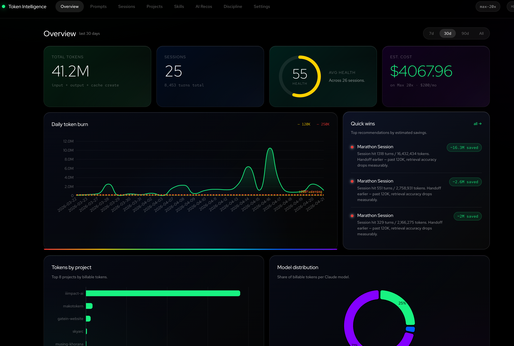
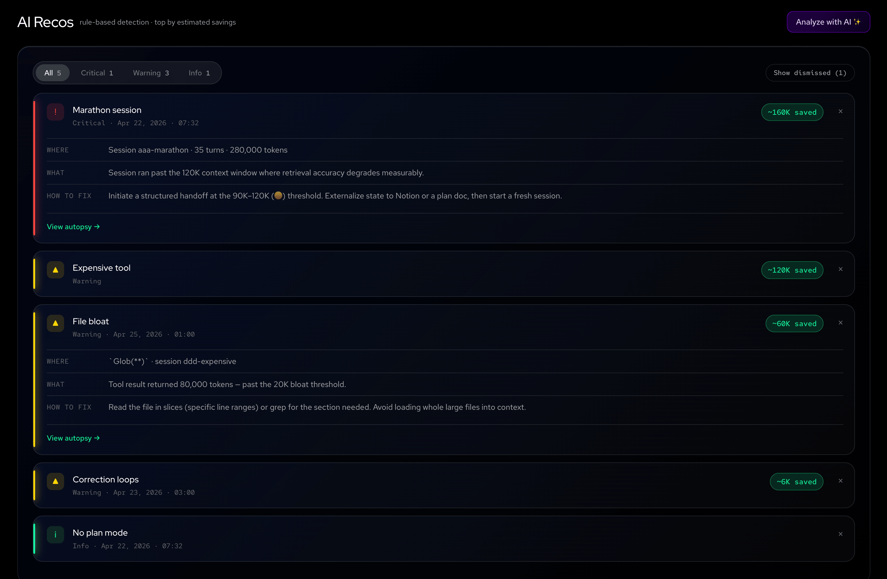
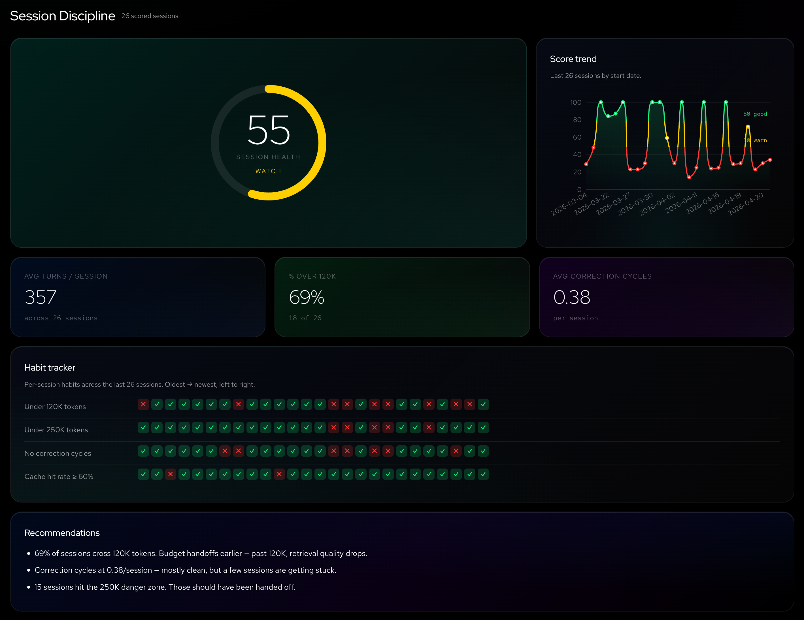
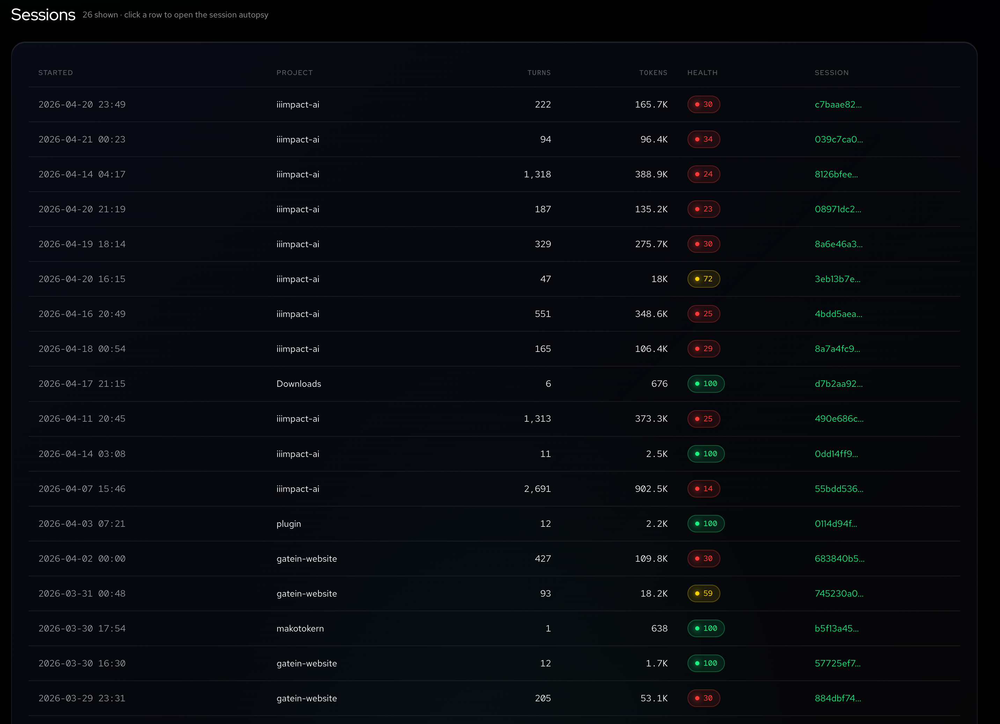

# Token Intelligence

**An IIIMPACT project.** Local dashboard for Claude Code token intelligence — usage analytics, session health scoring, AI-powered recommendations, and session discipline tracking.

Reads the JSONL transcripts Claude Code writes to `~/.claude/projects/` and turns them into per-prompt cost analytics, tool/file heatmaps, subagent attribution, cache analytics, project comparisons, a smart rule-based recommendations engine, per-session health scoring, and optional AI-powered analysis of your usage patterns.

**Everything runs locally.** No data leaves your machine — no telemetry, no remote calls for your data, no login. The AI analysis feature is opt-in and only sends aggregate metrics (never prompt text) to the Anthropic API when you explicitly click "Analyze with AI".

> **Based on the [upstream open-source `token-dashboard`](https://github.com/nateherkai/token-dashboard)** (MIT). Token Intelligence is an IIIMPACT fork that layers on session health scoring, AI-powered analysis, session discipline tracking, an expanded rules engine, and a redesigned UI. Full credit and thanks to the upstream project for the original scanner, server, DB schema, and the rule-based tips foundation this builds on.

## What's new vs. the original

- **Expanded rules engine** (`tips_engine.py`) — on top of the upstream cache / repeat-file / right-size / outlier rules, this adds marathon sessions, correction loops, task drift, redundant file reads, file bloat, large paste detection, output-heavy ratio, expensive tools, cache-miss streak, vague prompts, multi-task prompts, and missing-plan-mode patterns. 12 rules total, each emitting severity + estimated token savings.
- **Session health scoring** (`health_score.py`) — a per-session 0–100 score combining token discipline, cache efficiency, correction cycles, session length, and file-read efficiency. Exposed on every session row and aggregated into a trend line.
- **AI-powered analysis** (`ai_analyzer.py`) — opt-in "Analyze with AI" button on the AI Recos tab and "Autopsy with AI" on any session. Sends aggregate metrics only (never prompt text, file contents, or tool results) to Claude via `ANTHROPIC_API_KEY`. Results cached for 24h, rate-limited to one call per 60s. Off by default.
- **Token Intelligence design system** — Red Hat Display / Text / Mono typography, black-canvas glass cards with atmospheric accent gradients, severity-coded state (green `#19F58C` / yellow `#FFD600` / red `#FF423D` / cyan `#00FFE0` / purple `#8F00FF`). Fonts served locally; zero CDN calls.
- **Session Discipline tab** — 220px circular health ring, 30-session score trend chart with 80 / 50 threshold bands, habit tracker grid, rules-based recommendations driven by real aggregates.
- **CSV export + threshold customization** — export every session's health + discipline data, and tune the warning / danger token thresholds via a slider in Settings (persists to localStorage; Overview + Sessions charts pick it up on next render).

## Screenshots

### Overview


### AI Recos


### Session Discipline


### Sessions (detail view)


## What this is useful for

- Seeing which of your prompts are expensive (surprise: they usually involve large tool results).
- Comparing token usage and health across projects you've worked on.
- Spotting wasteful patterns — the same file read twenty times in a session, a tool call returning 80K tokens, a correction loop halfway through.
- Understanding what a "cache hit" actually saves you.
- If you're on Pro or Max, confirming you're getting your money's worth in API-equivalent dollars.
- Identifying where a session went off the rails, with per-turn compound token accumulation + optional AI autopsy.

## Prerequisites

- **Python 3.8 or newer** — already installed on macOS and most Linux. On Windows: `winget install Python.Python.3.12` or download from python.org.
- **Claude Code** — installed and with at least one session run. The dashboard reads those sessions.
- **A web browser.** Any modern one.
- **(Optional) `ANTHROPIC_API_KEY`** — only needed if you want the "Analyze with AI" and "Autopsy with AI" buttons. The rest of the dashboard works without it.

No `pip install`. No Node.js. No build step. Python standard library only.

## Quickstart

```bash
git clone https://github.com/makotoiiimpact/token-intelligence.git
cd token-intelligence
python3 cli.py dashboard
```

> On Windows, if `python3` isn't on your PATH, substitute `py -3` for `python3` in every command below.

The command:
1. Scans `~/.claude/projects/` (first run can take 20–60 seconds on a heavy user's machine).
2. Computes health scores and recommendations.
3. Starts a local server at http://127.0.0.1:8080.
4. Opens your default browser to that URL.

Leave it running; it re-scans every 30 seconds, recomputes health + recommendations, and pushes updates live via SSE. Stop with `Ctrl+C`.

### Enabling AI analysis (optional)

To light up the "Analyze with AI" button on **AI Recos** and the "Autopsy with AI" button on the **Sessions** detail view, set an Anthropic API key in your environment and restart the dashboard:

```bash
export ANTHROPIC_API_KEY=sk-ant-...
python3 cli.py dashboard
```

Or persist it in `~/.zshrc` / `~/.bashrc`. The dashboard confirms whether the key is configured in **Settings → AI analysis**. When disabled, the analysis buttons display "Configure API key in Settings" instead of failing.

## Where the data comes from

Claude Code writes one JSONL file per session here:

| OS | Path |
|---|---|
| macOS / Linux | `~/.claude/projects/<project-slug>/<session-id>.jsonl` |
| Windows | `C:\Users\<you>\.claude\projects\<project-slug>\<session-id>.jsonl` |

The dashboard never modifies those files — it only reads them and keeps a local SQLite cache at `~/.claude/token-dashboard.db`.

To point at a different location:

```bash
python3 cli.py dashboard --projects-dir /path/to/projects --db /path/to/cache.db
```

### Environment variables

| Var | Default | Purpose |
|---|---|---|
| `PORT` | `8080` | Port the local web server listens on |
| `HOST` | `127.0.0.1` | Bind address. Keep the default. Setting `0.0.0.0` exposes your entire prompt history to anyone on your local network — don't do this on any network you don't fully control. |
| `CLAUDE_PROJECTS_DIR` | `~/.claude/projects` | Where to scan for session JSONL files |
| `TOKEN_DASHBOARD_DB` | `~/.claude/token-dashboard.db` | SQLite cache location |
| `ANTHROPIC_API_KEY` | — | Optional. Enables AI analysis + session autopsy. Never required. |

Pricing lives in [`pricing.json`](pricing.json). Edit it directly if model prices change or to add a new plan.

## CLI reference

```bash
python3 cli.py scan          # populate / refresh the local DB, then exit
python3 cli.py today         # today's totals (terminal)
python3 cli.py stats         # all-time totals (terminal)
python3 cli.py tips          # active recommendations (terminal)
python3 cli.py dashboard     # scan + serve the UI at http://localhost:8080

# dashboard flags
python3 cli.py dashboard --no-open   # don't auto-open the browser
python3 cli.py dashboard --no-scan   # skip the initial scan (use cached DB only)
```

Change the port: `PORT=9000 python3 cli.py dashboard`.

## The tabs

Hash-routed single page. Each tab is backed by its own JSON API under `/api/`:

- **Overview** — 4 animated hero metric cards (total tokens, sessions, avg health, est. cost), daily token-burn area chart with dynamic warning/danger threshold lines, Quick Wins panel (top 3 recommendations by estimated savings), tokens-by-project horizontal bar, model-distribution donut, recent-sessions table with per-row health badges.
- **Prompts** — your most expensive user prompts ranked by tokens. Click any row to see the assistant response, tool calls made, and the size of each tool result.
- **Sessions** — list view with health-score color badges. Click a row for a detail view: 4 hero metric cards (health / turns / billable tokens / correction cycles), compound-token accumulation chart with 120K / 250K threshold markers and red dots at detected correction turns, per-turn table with correction rows highlighted, "Autopsy with AI ✨" button.
- **Projects** — per-project cards with avg health-score badge, token-efficiency horizontal bar (tokens per session), compact per-card stats.
- **Skills** — which skills you invoke most often, and (where we can measure them) their token cost.
- **AI Recos** — All / Critical / Warning / Info filter pills, severity-bordered recommendation cards sorted by estimated savings, "Analyze with AI ✨" button that produces a purple glass panel with summary + bullet recommendations.
- **Session Discipline** — 220px circular health ring (banded green / yellow / red), 30-session score trend chart, habit tracker grid (under 120K tokens / under 250K / no correction cycles / cache hit ≥ 60%), avg-turns / % over 120K / avg corrections metric cards, rules-based recommendations panel.
- **Settings** — pricing plan selector, pricing table, AI analysis configured/not-set status pill, token threshold sliders with warn/danger customization (persisted to localStorage), sessions CSV export, privacy reminder.

## Troubleshooting

**"No data" or empty charts.** Run `python3 cli.py scan` once to populate the DB, then reload.

**Port 8080 already in use.** `PORT=9000 python3 cli.py dashboard`.

**Numbers look wrong / stuck.** The DB lives at `~/.claude/token-dashboard.db`. Delete it and re-run `python3 cli.py scan` to rebuild from scratch.

**"Analyze with AI" shows "Configure API key".** Set `ANTHROPIC_API_KEY` in your environment and restart the dashboard. Check the **Settings → AI analysis** card to confirm.

**"Analyze with AI" returns 429.** The analyzer rate-limits to one Claude API call per 60 seconds. Wait a minute and retry.

**Running the dashboard twice at the same time.** Don't — both processes will fight over the SQLite DB.

## Accuracy note

Claude Code writes each assistant response 2–3 times to disk while it streams (the same API message gets snapshotted as output grows). The dashboard dedupes these by `message.id` so the final tally matches what the API actually billed.

## Privacy

Nothing leaves your machine by default. No telemetry. No remote calls for your data. The browser fetches its JSON from `127.0.0.1`, and all JS / CSS / fonts are served from that same local server — ECharts is vendored, Red Hat fonts are bundled in `web/fonts/`, zero CDN calls.

The AI analysis feature (Settings → AI analysis) is the one sanctioned outbound path, behind a feature flag you control. When you click "Analyze with AI" or "Autopsy with AI":
- Only **aggregate metrics** are sent (counts, sums, averages, turn numbers).
- **Never** sent: prompt text, file contents, tool results, session IDs beyond the one you're analyzing.
- Results are cached locally for 24 hours so you don't re-call on every reload.
- Requests are rate-limited to one per 60 seconds.

Press `Cmd/Ctrl + B` anywhere in the UI to blur prompt text and other sensitive content for screenshots.

## Tech stack

Python 3 (stdlib only) for the CLI, scanner, DB, HTTP server, and AI analyzer. SQLite for the local cache. Vanilla JS + ECharts (vendored) for the UI, no build step. Red Hat Display / Text / Mono for typography, served from `web/fonts/`.

Data flow: `cli.py` → `token_dashboard/scanner.py` → SQLite DB → `token_dashboard/{tips_engine,health_score,ai_analyzer}.py` → `token_dashboard/server.py` exposes `/api/*` JSON routes and serves `web/`.

## Further reading

- [`CLAUDE.md`](CLAUDE.md) — conventions and architecture overview
- [`CONTRIBUTING.md`](CONTRIBUTING.md) — how to develop and test
- [`docs/design-system.md`](docs/design-system.md) — full design-system reference (colors, typography, components, chart theme)
- [`docs/KNOWN_LIMITATIONS.md`](docs/KNOWN_LIMITATIONS.md) — rough edges
- [`docs/inspiration.md`](docs/inspiration.md) — prior art

## Credits

- **Upstream**: [open-source `token-dashboard`](https://github.com/nateherkai/token-dashboard) — scanner, server, DB schema, original rule-based tips engine, inspiration template.
- **IIIMPACT additions**: health scoring, AI analysis, session-discipline tab, expanded rules engine, Token Intelligence design system, CSV export, threshold customization.
- **Fonts**: Red Hat Display / Text / Mono (SIL Open Font License 1.1).

## License

[MIT](LICENSE). © 2026 IIIMPACT LLC. Portions based on [token-dashboard](https://github.com/nateherkai/token-dashboard), MIT licensed.
